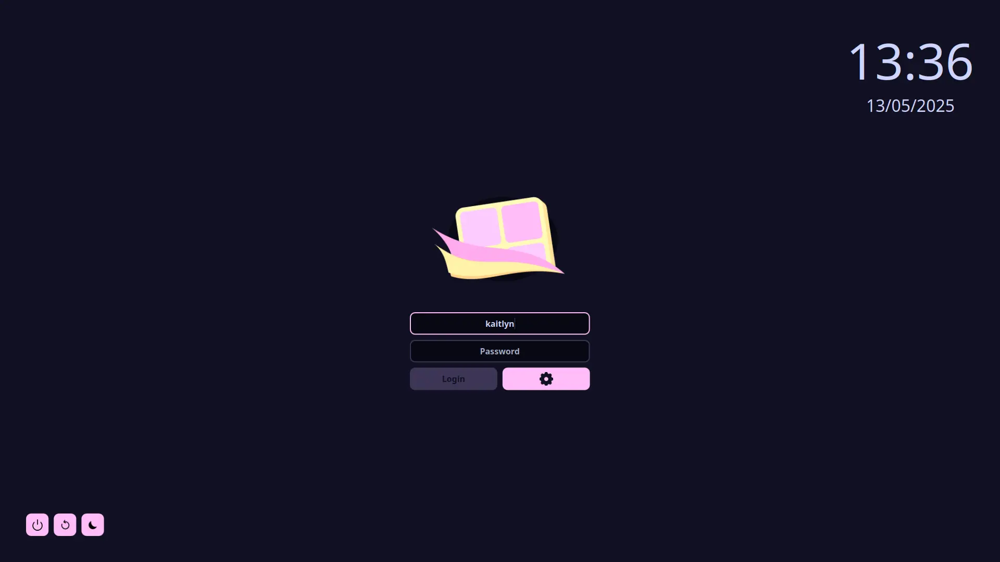

<h2 align="center">
	<br/>
	Marzipan Theme for <a href="https://github.com/sddm/sddm/">SDDM</a>
</h2>

<h6 align="center">
	A delicious & rich theme to make <i>SDDM</i> sugar sweet.
	<br/>
	<br/>
	Based on <a href="https://github.com/catppuccin/sddm">Catppuccin for SDDM</a>
</h6>

<p align="center">
	
</p>

## Usage

1. Ensure you have the [dependencies](#dependencies).
2. Download the theme in `theme/marzipan`
3. Copy the theme into `/usr/share/sddm/themes/`
4. Edit the file `/etc/sddm.conf` and change the theme in there to `marzipan`.

- If you don't have this file make one with `.conf` extension and make sure it has these two lines within the config:

```
[Theme]
Current=marzipan
```

## Dependencies

### Arch Based OS

```sh
pacman -Syu qt6-svg qt6-declarative qt5-quickcontrols2
```

### Debian Based OS

```sh
apt install --no-install-recommends qml-module-qtquick-layouts qml-module-qtquick-controls2 libqt6svg6
```

### RPM Based OS

```sh
dnf install qt6-qtquickcontrols2 qt6-qtsvg
```

### Solus OS

```sh
eopkg install qt6-quickcontrols2 qt6-svg
```

## Configuration

- `Font`: The chosen font
- `FontSize`: The text size
- `ClockEnabled`: Whether the clock is on or off, this should be set to either `true` or `false`
